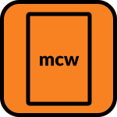

    
    <h1>mcw - most common word</h1>

---

## Features

- Multithreaded with tokio
- Written in Rust
- Partially customizable using presets

**NOTE: mcw is still under developement** check out what features are under development: 
[TODO.md](TODO.md)

## About

mcw is CLI app that does what it says - takes files as input and outputs most common words. Written in Rust.

## Using Program

Zero/First Argument: executable -- Example: `./path_to_exec`

First/Second Argument: files to read -- Example: `file1.txt` (if you want to pass more files write them `'HERE'`, example: `'file1.txt file2.txt file3.txt'`),

Second/Third Argument: range that word should repeat in beetwen to be mentioned -- Example: `0.10` will return words that repeat from `0` to `10` times

Second/Third Argument: number that word should repeat to be mentioned -- Example: `1`

Third/Fourth Argument: preset (read [PRESETS.md](PRESETS.md)) -- Example: `text_preset`

-Example Formulas-

`./path_to_exec 'file1.txt file2.txt' 0.10 test_preset`

`./path_to_exec pan-tadeusz.txt 0.100 polish_text_preset`

`./path_to_exec main.c 0.10 c_preset`

`./path_to_exec 'file1.txt file2.txt' 5.10 test_preset`

`./path_to_exec pan-tadeusz.txt 10.100 polish_text_preset`

`./path_to_exec main.c 0.10 c_preset`

-EOEF-

## Building Project from source

Make sure you have Rust (rustc, cargo) installed

1. Clone repo using git: `git clone https://github.com/Matissoss/mcw`
2. Compile project using Rust (cargo method: `cargo build --release`)
3. Enjoy

## Customization

Read [PRESETS.md](PRESETS.md)

## Credits

CLI was made by MateusDev using Rust, `colored`, `tokio-rs` and `toml` crate/crates
